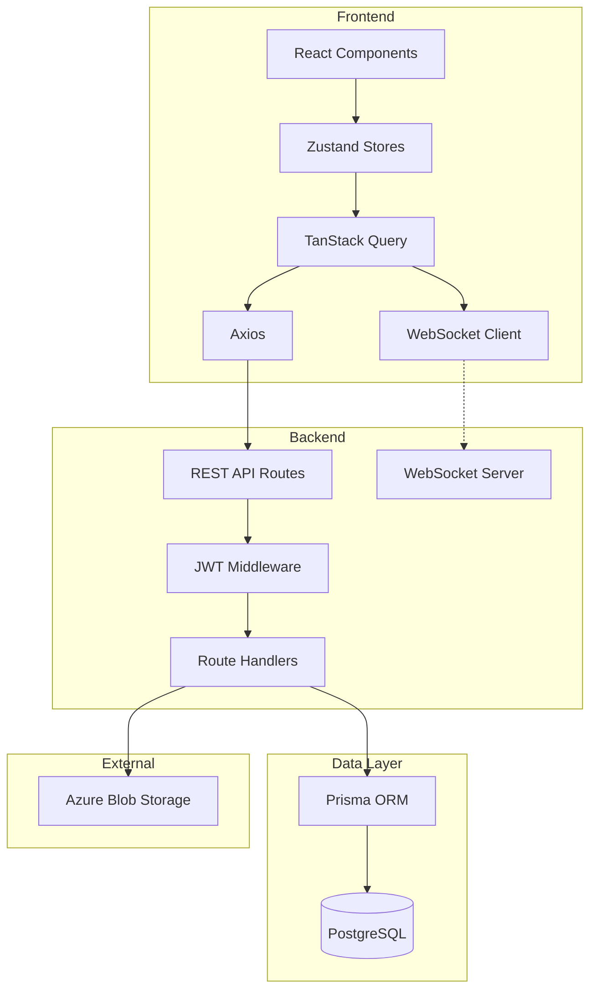

# Confluence

A real-time broadcast chat application with room-based messaging.

**Note:** This app uses native WebSocket connections via the `ws` library, which requires a persistent Node.js server. Vercel's serverless functions spin down after each request and cannot maintain persistent connections. If deployed to Vercel, the room page will fail to connect.

## Features

- Real-time messaging via WebSockets
- Create and join chat rooms
- User authentication with JWT
- Message reactions and read receipts
- Reply to messages
- Media attachments
- Responsive design

## Tech Stack

**Backend:** Node.js, Express, TypeScript, PostgreSQL, Prisma, WebSocket (`ws` library), JWT, Azure Blob Storage

**Frontend:** React 19, TypeScript, Vite, Tailwind CSS, Zustand, TanStack Query, Axios, GSAP

## Architecture



## Environment Variables

**Backend:**
```
JWT_SECRET=my-jwt-secret
DATABASE_URL=https://my-db-url
```

**Frontend:**
```
VITE_BACKEND_URL=http://my-backend-url
```

## Run Locally

**Prerequisites:** Node.js 18+

Clone the project:
```bash
git clone https://github.com/captainskyfish/confluence
```

Install dependencies:
```bash
# Backend
cd confluence/backend
npm install

# Frontend
cd confluence/frontend
npm install
```

Start the servers:
```bash
# Backend
cd confluence/backend
npm run dev

# Frontend
cd confluence/frontend
npm run dev
```

**Deployment options:**
- Use a VPS (Azure, DigitalOcean, AWS EC2, Railway, Render, etc.) that supports persistent processes
- Or refactor to use a third-party real-time service (Pusher, Ably, Supabase Realtime) that works with serverless 
